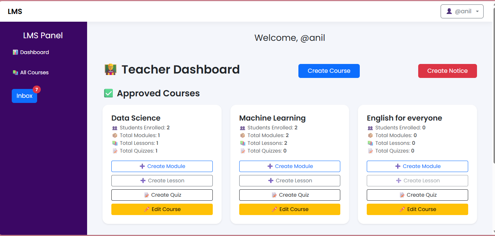
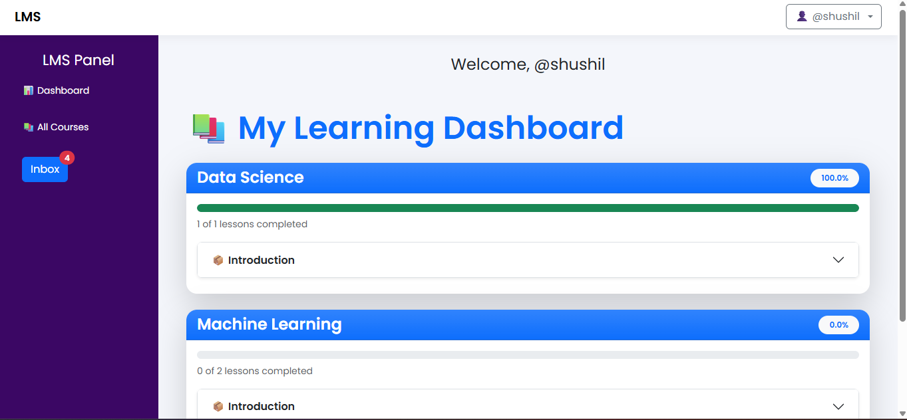

# 🎓 Learning Management System (LMS)

A full-stack web-based **Learning Management System** built with Django that allows **Admins, Teachers, and Students** to manage courses, enrollments, and real-time notifications.

---

## 🚀 Features

- 🔐 Role-based Authentication (Admin / Teacher / Student)
- 📚 Course Creation & Management
- 📝 Student Enrollment System
- 📢 Notice & Announcement Module
- 🔔 Real-time Notifications using WebSockets (Django Channels)
- ⚡ Modern UI with Bootstrap
- 🧑‍💻 Secure & Scalable Architecture

---

## 🛠 Tech Stack

- **Backend:** Django, Django REST Framework  
- **Realtime:** Django Channels + Redis  
- **Frontend:** HTML, CSS, Bootstrap, JavaScript  
- **Database:** PostgreSQL / SQLite (development)  
- **Server:** ASGI + Daphne / Uvicorn  

---

## 🧱 System Architecture

Client (Browser)
↓
Django Views / APIs
↓
Django Channels (WebSockets)
↓
Redis (Channel Layer)
↓
PostgreSQL / SQLite


---

## 👥 User Roles

| Role     | Permissions |
|----------|---------------------------------|
| Admin    | Manage users, courses, notices  |
| Teacher  | Create courses, publish notices |
| Student  | Enroll in courses, view notices |

---

## ⚙️ Installation & Setup

### 1️⃣ Clone the Repository

```bash
git clone https://github.com/shushilshah/learning_ms_django.git
cd lms_system

# Create virtual environment
python -m venv venv
source venv/bin/activate   # On Windows: venv\Scripts\activate

# Install dependencies
pip install -r requirements.txt

# migrate database
python manage.py makemigrations
python manage.py migrate

# create superuser
python manage.py createsuperuser

# run redis server
redis-server

# start development server
python manage.py runserver

or with ASGI + Daphne
daphne -p 8001 lms_system.asgi:application

# Create .env file
## list down all the secret key for development

```

## 🔁 Real-Time Notification Flow

1. Teacher/Admin publishes a notice

2. Notice saved in database

3. Django Channels sends WebSocket event

4. Students receive instant notification

# 📸 Screenshots
1. Teacher Dashboard:


2. Student Dashboard:
